## 1. Model, estimation and simulation settings

Here, we consider a classical linear model

$$
\begin{equation}
y = y_0 + \epsilon = \mathbf{x}^T \boldsymbol{\beta}_0 + \epsilon
\notag
\end{equation}
$$

where $$\epsilon\sim N(0,1)$$, $$\mathbf{x}\in\mathbb{R}^{q}$$ and $$q$$ is allowed to greater than $$n$$. 
Let $$X\in\mathbb{R}^{n\times q}$$ and $$Y\in\mathbb{R}^{n}$$ be the matrix of $$n$$ observational input and output variables from the model above. Denote $$Y_0$$ by the vector of true outcomes. 

We are familiar with the bias-variance trade-off discussion in penalized LSE, where test error displays a U curve as the model complexity (number of non-zero coefficients in the model) increases. 

### Estimator

Let the number of variables used in the regression model as $$p\in\{1,\dots,q\}$$. We use the first $$p$$ variables of $$X$$ to regress $$Y$$. For the convenience of notation, we denote the training samples of first $$p$$ variables by $$X\in\mathbb{R}^{p}$$ (This symbol is somewhat ambiguous). 

+ When $$p \le n$$, we can use ordinary least square to estimate the coefficients. In general, it is feasible. The estimator is given by $$\hat{\boldsymbol{\beta}}_1 = (X^T X)^{-1}X^T Y$$. 

+ When $$p > n$$, since $$X^T X$$ in the OLS estimator is irreversible, we cannot directly use $$\hat{\boldsymbol{\beta}}_1$$ to estimate the coefficients. While a pseudo inverse is feasible. Suppose $$X$$ has the following SVD decomposition, $$X=UDV^T$$ where $$D=\begin{pmatrix}D_1 & \mathbf{0}\end{pmatrix} \in\mathbb{R}^{n\times p}$$,  $$D_1$$ is a non-singular diagonal matrix of order $$n$$ whose elements are non-zero singular value of $$X$$, and  $$U\in\mathbb{R}^{n\times n}$$ and $$V\in\mathbb{R}^{p\times p}$$ are matrices of corresponding left and right singular vectors. 
Then, $$(X^T X)^{-} = (V D^T D V^T)^{-} = V\begin{pmatrix}D_1^{-2} & D_2 \\ D_3 & D_4\end{pmatrix}V^T$$ where $$D_2, D_3, D_4$$ is arbitrary real matrices that makes calculation sense. (Generalized inverse is not unique.) LSE using pseudo-inverse is $$\hat{\boldsymbol{\beta}}_{-} = (X^T X)^{-} X^T Y = V\begin{pmatrix}D_1^{-1} \\ D_3D_1\end{pmatrix}U^T Y$$. Consider the $$\ell_2$$ norm of the estimator, we have that $$\|\hat{\boldsymbol{\beta}}_{-}\|_2 \le \left\| \begin{pmatrix}D_1^{-1} \\ \mathbf{0}_{p-n,n}\end{pmatrix} U^T Y\right\|_2$$ the upper bound is achieved when $$D_3$$ is a zero matrix. 
By the principle of Occam's Razor, it is suggested that the simplest of competing theories is preferred to the more complex. In order to choose the simplest estimator with respect to $$\ell_2$$ norm, we select $$\hat{\boldsymbol{\beta}}_2 = V \begin{pmatrix}D_1^{-1} \\ \mathbf{0}_{p-n,n}\end{pmatrix} U^T Y$$. 

We use the above estimators $$\hat{\boldsymbol{\beta}}_1$$ 与 $$\hat{\boldsymbol{\beta}}_2$$ to learn the information in the sample. When $$p > n$$,  $$\hat{\boldsymbol{\beta}}_2$$ has a certain compression effect as mentioned before. 

Next, we discuss the **double descent curve** of the test error in the linear model. 


### Our focus

Explore the reasons for the traditional U-shaped curve in low-dim setting and the double descent curve in high dim setting. 

What if we use a ordinary LSE when $$p\le n$$ when model is misspecified? Will there be a U-shaped curve? 

And what if we use LSE with M-P pseudo-inverse when $$p>n$$? How will squared bias and variance change? 

### Simulation setting 

Consider here the influence of different simulation settings on the double falling curve. The images show the test error (black solid line), squared bias term (green dotted line), variance term (blue dotted line), irreducible error term (red horizontal dashed line), the sum of squared bias variance and  irreducible error (black dotted line, almost coincides with the test error), interpolation point (red vertical dotted line). 

$$\mathbf{x}\sim N(\mu, \Sigma)$$, 抽样 $$n$$ 次, 其中 $$75\%$$ 用于训练, 剩余的样本用于测试, $$\mu$$ 的取值在后文讨论, 协方差矩阵 $$\Sigma$$ 设置为自回归形式, 即 $$\Sigma_{i,j} = \rho^{\vert i-j \vert}$$, $$\rho$$ 的取值在后文讨论. 


The expected test error can be decomposed as the sum of irreducible error, squared bias term and variance term. 

Bias term: $$\sum_{i\in \text{Test}} (X_i \hat{\boldsymbol{\beta}}_0 - Y_0)^2$$; 它与样本量与预测性能有关, 样本越多, 它越准则 (波动越小); 预测值与 (未知) 真实值越接近, 它越小. OLS 框架下, 它表示回归时遗漏信号的大小 (各协变量的样本方差乘以参数的平方之和). 


Variance term: $$\sum_{i\in \text{Test}} (X_i \hat{\boldsymbol{\beta}} - X_i \hat{\boldsymbol{\beta}}_0)^2$$; 它与样本量以及参数个数有关, 样本量越大它越小, 变量越多它越大. 在 OLS 框架下有具体地分析. 方差项的理论值在已知 $$Y_0$$ 时可以具体计算. 

irreducible error: $$\sum_{i\in \text{Test}} (X_i \hat{\boldsymbol{\beta}}_0 - Y_i)^2$$; 它与样本量有关, 当样本量足够大时, 它趋向于随机误差的方差. 

且为了凸显曲线的形状, 使曲线更加平滑, (如无额外说明) 图的纵坐标都使用对数轴. 后文对此进行了讨论. 

We load the following packages in our code. 

```R
library(MASS)     # for mvrnorm()
library(parallel) # for detectCores()
```

## 2. U curve
在线性模型的设定中, 增加变量数量, 观察 U 型曲线, 根据误差的分解, 研究是什么因素导致了测试误差的 U 型. 

### Q & A

+ **bias 是否会随着变量的增加而增加?** 

> 答: 会, 这与传统的 bias-variance trade-off 相左. 
>
例子: 如 Case 1, 2 图, 如果不遗漏变量, bias 在末尾下降至 0. 而 Case 4 中遗漏了模型中的非零变量, bias在后半段不仅不降低, 反而增加了.

解释: 由于 bias 项受到样本量以及预测性能的影响. (预测性能/能力, 解释为在无限多样本的情况下, 预测方法的最佳表现.) 
一方面, 虽然在变量逐渐都纳入回归时, 预测性能逐渐趋于 (回归方法的) 最佳. 注意到, 此时最佳参数并不能最小化训练误差. 
另一方面, 样本量也影响了 bias 项, 在样本量略微大于变量数时, (特别是遗漏了非零变量的插值时) 回归方法 (OLSE) 可以利用任何变量解释训练数据. 事实上, 插值点之前, 由于变量增多, 变量张成的空间也增大, 因此可以持续地降低训练误差, 但为这些变量分配的错误的系数会反向增大测试误差 (模型越来越差); 且在插值时训练误差必然为 0, 而测试误差达到最大. 
因此从观测值中得到一个远离真实模型的过拟合的模型, 使得出现了模型越来越好但是 bias 反而越来越大的情况. 但是当模型没有遗漏非零变量时, 正确的系数恰好对应了最好的插值, 此时偏差为 0. (可以参考 3.3 节对样本的讨论, 只要有足够多的样本, 偏差可以保持非增, 即使不降低至 0.)
这一点可以通过观察 $$\|\hat{\boldsymbol{\beta}}\|_2$$ 有更加直观的理解. 

+ **为什么方差递增, 在插值处加速达到峰值?**

> 答: OLS 框架可以解释方差递增问题, 但是 (错误的) 过拟合才能解释峰值.

解释: OLS 框架下讨论过估计量的方差, 为 $$\sigma^2 p/n$$; 但这只能解释前半段, 样本充足时方差缓慢增长的趋势. 但是接近插值点时, 方差快速且剧烈地增长. 这个现象, 直观上, 我认为是样本数过于接近变量数, LSE 更偏向于插值而不是回归, 此时系数的估计量失真, 远远地偏离正确值, 造成预测值也产生了较大的偏差.  更具体地, 系数估计值的误差为 $$(X^TX)^{-1}X^T \epsilon$$, 这一项本来由于 $$\epsilon$$ 与 $$\mathbf{x}$$ 的独立性, 是接近于 0 的, 但在插值时, 随机误差可以被变量 (错误地) 解释, 即增加了估计量的范数, 从而增加了预测值的大小. 更严格地推理需要从数学上下手, 可以通过分析 $$\|X_{test} (X^TX)^{-1}X^T \epsilon\|_2$$ 得知具体的情况. 

### 2.1 Tuning coefficients $$\boldsymbol{\beta}$$  of $$\mathbf{x}$$
#### Case 1: All elements in $$\boldsymbol{\beta}_0$$ are non-zero
200 个样本, 150个变量. 每个变量都赋予了随机的非零系数 (采样于均值为二项分布且方差为1的正态分布). 


从图中可以看出, 当变量从 1 增大到 120 时, 测试误差基本不变, 其中方差不断增加, 偏差基本保持不变, 此时方差项对测试误差的影响较小可以忽略不记; 
当变量继续增大, 方差维持相同的趋势增长, 但偏差迅速下降, 导致测试误差先下降再上升, 呈现 U 型. 


由于随机性的影响, 测试误差或bias在变量数为 1--120 时的 (几乎) 水平趋势. 如样本量充足, 试误差或 bias 将规律地递减. 


下面, 我们将数据 $$Y$$ 进行了标准化, 让误差曲线的范围 (大致) 在 $$[0,1]$$ 之间. 

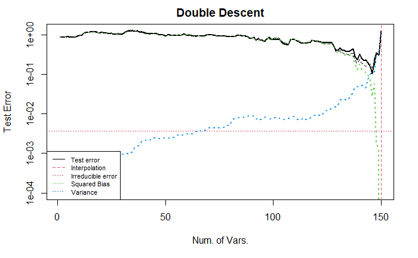

如图所示, 曲线与不标准化的曲线完全一致, 只是坐标轴不同, 导致一些尺度不同. 
该设置模仿了 [Belkin et al. 2018](https://arxiv.org/abs/1812.11118v2). 

下面, 我们将协变量的顺序进行了随机排序, 保留了对 $$Y$$ 的标准化 (即对系数的标准化). (由于采用的是自回归形式的协方差, 因此邻近变量的相关性强, 距离较远的协变量相关性较弱. 这会影响bias曲线的变化过程). 

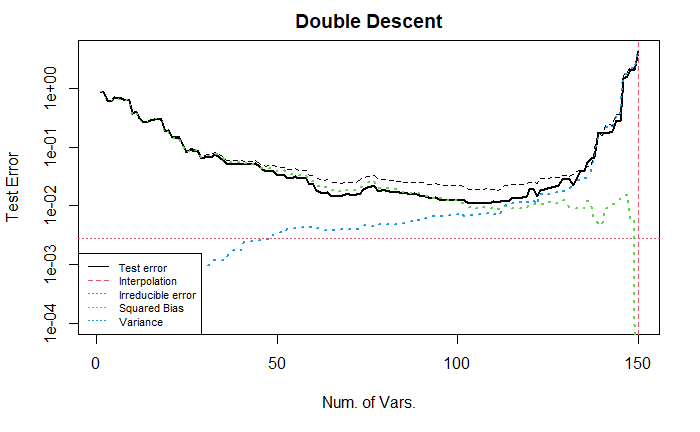

上图展示了较为标准的 U 型曲线. 
**我不清楚为什么经过随机排序后的误差曲线会展现出 U 型**. 
直观上, 由于我们在回归时逐个增加变量, 变量的排序会影响回归的效果, 例如按照系数大小排序或者随机排序的结果显然是不同的. 

同时, 要注意到上面展示的都是对数变换后的纵轴, 实际的 (未经过对数变换) 测试误差曲线更加陡峭, 如下所示. 

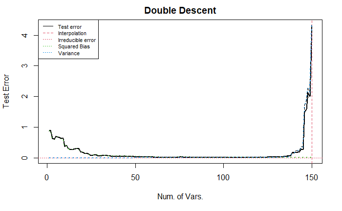

#### Case 2: Special $$\boldsymbol{\beta}_0$$
与上面的情况形成对比, 在这里, 我们设置非零的系数出现在较前的变量中 (1--70), 而靠后的变量都是冗余变量 (系数为0). 

偏差曲线随着变量个数得增加而持续下降, 当变量数为 70 时, 所有真实的变量都被纳入回归, 此后的偏差项保持为 0 不变. 
该图依然显示出了测试误差的 U 型. 

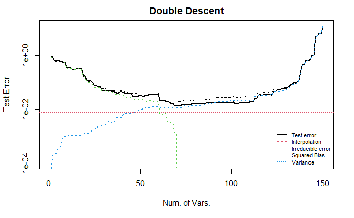

#### Case 3: Special $$\boldsymbol{\beta}_0$$

与上面的情况形成对比, 考虑所有系数都非零, 但将前半部分 (1--70) 系数增大, 此时不调整 x 的顺序. 

从图中可以看出, 变量个数在 25--70 时, 测试误差逐渐下降; 70--120 时, 稳定; 之后加速下降到 0. 


下图展示了调整 x 的顺序后的结果. 
需要注意到, 当变量个数大于 70 时, bias 下降缓慢. (小的系数对应的变量被纳入回归带来的小幅度的变化在前面的例子中可能也存在, 但是由于比例太小, 在图中无法显示出来)

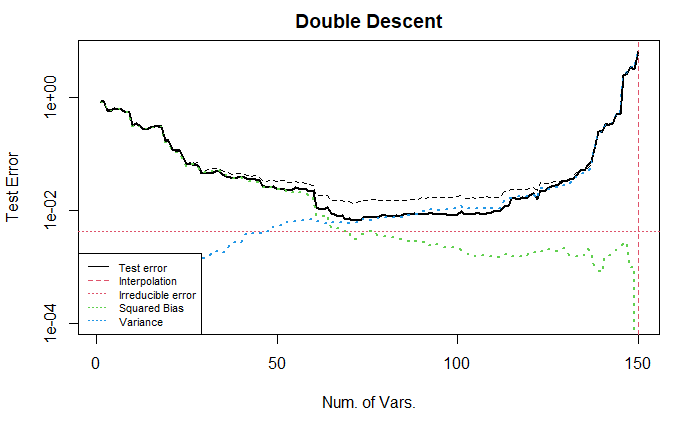


#### Case 4: Misspecified model

这里我们从另一个角度来考虑模型的设定, 将随机误差视为未纳入模型的非零变量. (参考 Q & A 1)

下面我们考虑所有模型都是误设定的情况, 即在回归中忽略一些非零变量, 此时可以预计 bias 曲线不会下降到 0 而是下降到某个定值. 
注意, 模型误设定等价于将没有考虑的变量与随机误差项合并, 这里的改动等价于修改了随机误差. 测试误差 / 方差曲线并不会变动. 
但是由于正确模型是已知的, 因此 bias 曲线会变动. 即偏差与方差之和 (黑色虚线) 会变动.

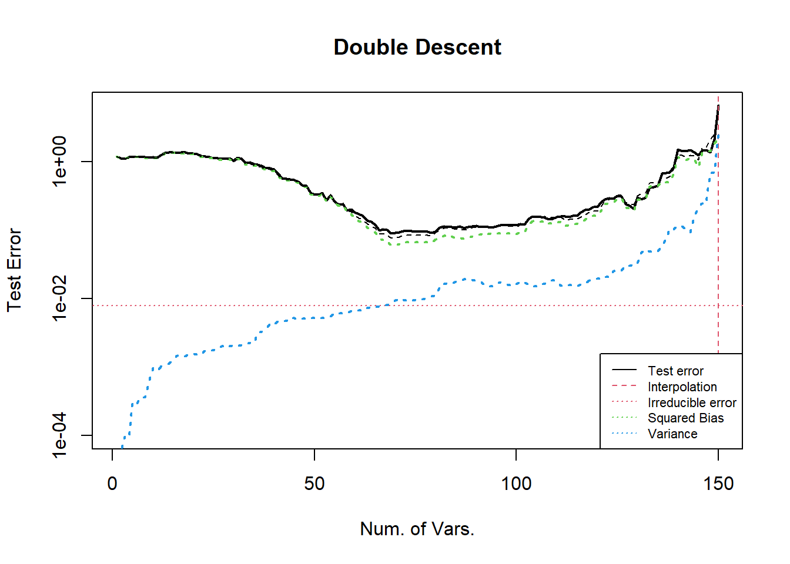


下图展示的是将引入的信息放在随机误差项中的情况. 

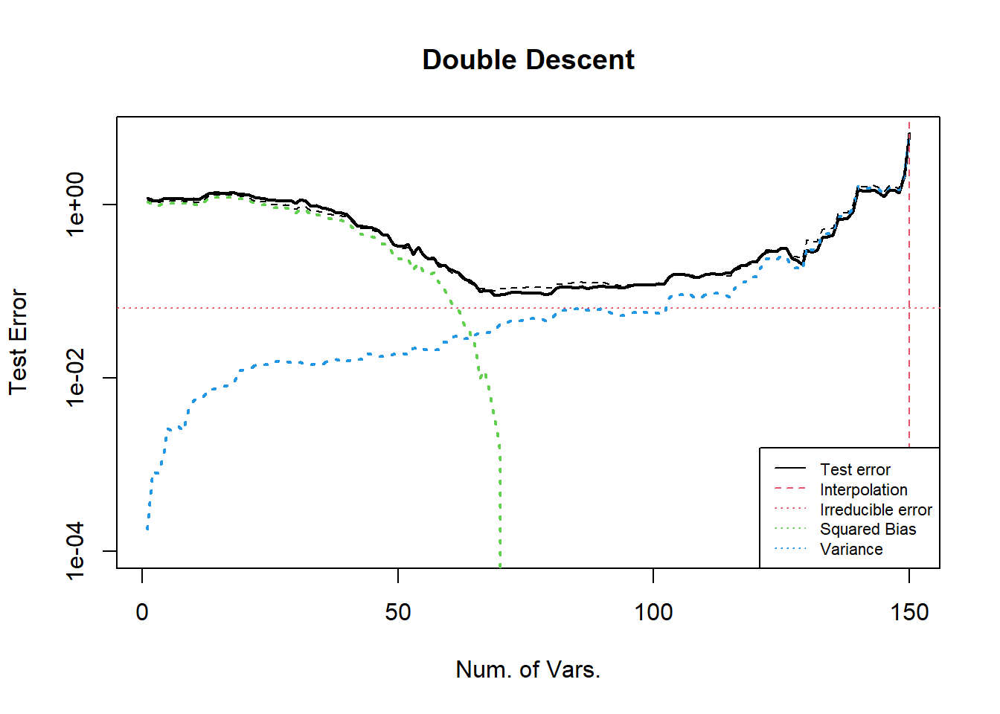

可以发现, 偏差项在纳入了所有正确变量之后, 降低到了 0; 同时相比于上一个例子 irreducible error 增加了; 方差曲线没有变化. 

### 2.2 Tuning covariance $$\Sigma$$ of $$\mathbf{x}$$
与上面的例子不同的是, 这里将变量间的相关系数调低. 
首先考虑所有系数都非零的情况, 可以从图中看到, 类似于自回归结构的协方差矩阵的结果, 当几乎所有变量都被纳入回归后, 偏差才(急速)下降.

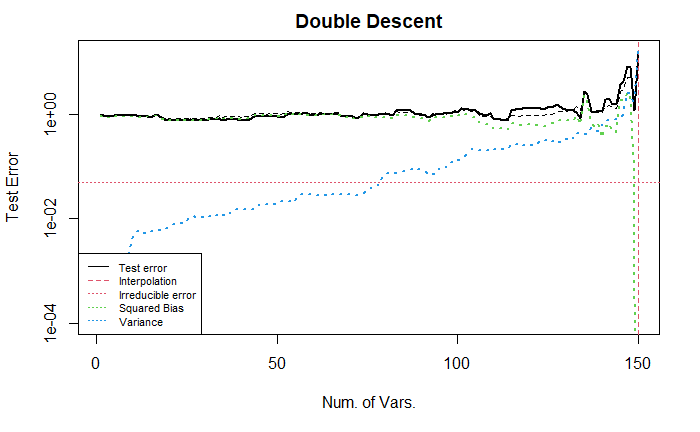

接着, 我们考虑第二种系数设定(后半部分全为零). 

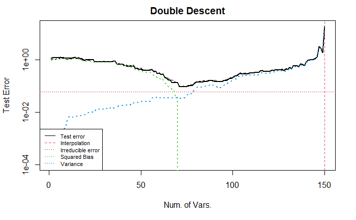


### 2.3 Tuning sample size

这里, 将独立样本以及 Case 1 的系数的设置略作修改, 样本个数从 200 调整为 2000, 可以去掉部分随机性, 同时凸显出变化的本质. 
由于变量个数依旧为 150, 没有改变, 因此下面的图中都没有出现 U 型, 而是单调递减的直线/曲线. 

*注意, 这一部分的纵坐标不做对数变换. (因为我希望直观的观察每个变量对测试误差的影响)*

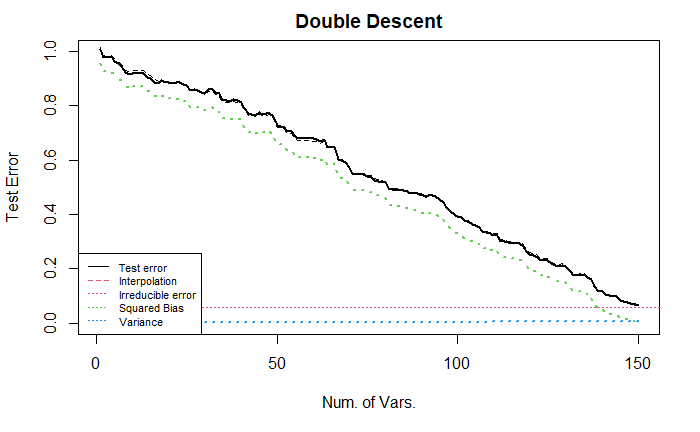

上图中, 绿线线性地递减, 告诉我们, 每个非零变量被纳入回归中, 都会带来测试误差的降低, 并且样本量充足时, 偏差可以降低到 0. 
蓝线几乎水平, 表明当样本足够多时, 方差项几乎不变. 

下面, 我们将样本的相关性增加 (参数为 0.9 的自回归结构). 

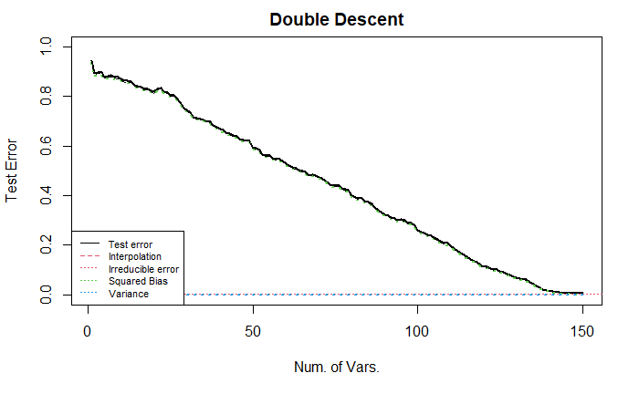

该图中的偏差项与上图类似; 而方差项降低了, 始终保持 0, 即样本的增加让每个线性回归得到的系数与拟真的系数之间的距离减小了. 

下面, 我们在上述的基础上, 将样本随机排序 (样本独立时, 不需要进行随机排序, 因为排序之后的样本协方差结构不变, 结果显然不变. 但是样本不独立时, 结果如下.)

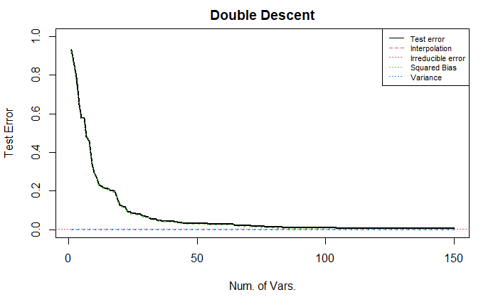

该图展现出前半部分的变量对测试误差的下降有巨大的贡献, 但后半部分的变量对测试误差几乎没有影响(有, 但是较小). 

我认为, 这是因为样本随机排序之后, 相邻变量之间的相关性不高, 但是远距离变量之间的相关性却有可能很高 (0.9), 因此, 在前半段的变量中, 可能某些变量并不是非零变量 (而是冗余变量), 但由于它可能与某些非零变量高度相关, 因此在回归中包含了部分由于这种相关性带来的信息, 导致测试误差下降. 
同时, 当它对应的真实非零变量被纳入回归中时, 真实变量具有比冗余变量更多的信息, 因此可以让测试误差继续 (小幅度地) 下降. 
因此, 随着变量个数的增加, 越来越少的信息被新纳入回归模型中, 即对应了测试误差曲线的导数越来越接近 0.  


### 2.4 Tuning random error $$\epsilon$$

这里我们使用 3.1 节中的 Case 2 来设置系数, 考虑增大随机误差项 (方差扩大 10 倍), 参考 3.1 节 Case 4, 这种调整等价于调整模型的设定, 让回归忽略更多的有效变量. 

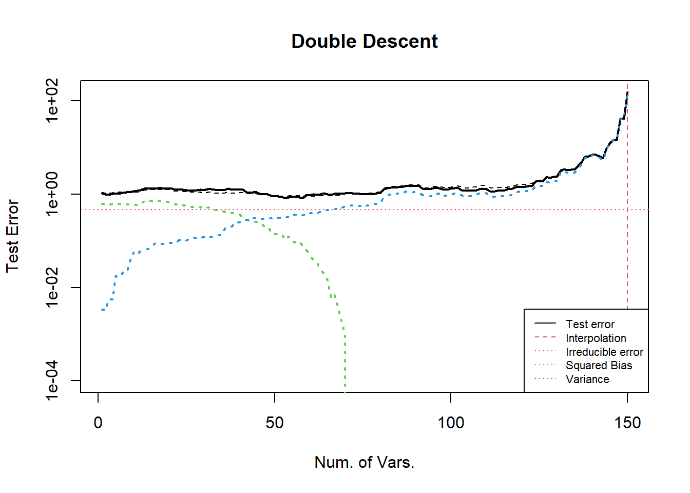

可以发现, 方差项在插值点处具有更高的峰值 (差不多也是 10 倍). 

### 2.5 Summary and Code

上述部分调整了样本大小 n, 变量 x 的协方差结构, 变量系数的结构. 
所有调整都可以通过下面的代码实现. 

```R
set.seed(1111)
## settings
n <- 200  # default: 200; special: 2000
p <- 149  # default: 149;
n_train <- as.integer(n * 0.75)
n_test <- n - n_train
# model settings
mean_x <- c(rep(0,p))
sigma_x <- matrix(0,p,p)     
for (i in 1:p){
  for (j in 1:p){
    sigma_x[i,j] <- 0.9^abs(i-j)      # 0.01 0.9
  }
}
mean_e <- c(rep(0,n))
sigma_e <- diag(x=1,n,n)
x <- mvrnorm(n=n,mean_x,sigma_x)
#x <- x[, sample(p)]                  # Random sorting columns of x
e <- mvrnorm(n=1,mean_e,sigma_e) * 2  # variance of random error 2
beta0 <- c(rep(0,p))

### setting beta0
## Case 1
mean_beta <- rbinom(p, 10, 0.3) * 4
beta0 <- mvrnorm(n=1, mean_beta, diag(p))
beta0[which(abs(beta0) < 1e-1)] <- 0
## Case 2
# beta0[(1:35)*2] <- rep(40, 35)
## Case 3
# mean_beta <- rbinom(p, 10, 0.3) * 4
# beta0 <- mvrnorm(n=1, mean_beta, diag(p))
# beta0[(1:35)*2] <- rep(80, 35)
# beta0[which(abs(beta0) < 1e-1)] <- 0
beta0 <- beta0 / norm(beta0,type="2") * 8   # control SNR

# linear model (corrected / mis-specificted model)
y0 <- x %*% beta0 + mvrnorm(n=n,rep(0,20),diag(20)) %*% rep(0.5,20)
y <- y0 + e # * 10
## some standardization
beta0 <- beta0 / sd(y)
y0 <- y0 / sd(y)
y <- y / sd(y)
```

## 3. Double descent curve

要展示双下降, 我们在 U curve 的基础上, 增加 (与模型变量相关的) 变量的个数. 

可以操控的因素与 U curve 中提及的类似. 下面我们讨论不同因素对曲线的影响. 以及如何才能展示出较完美的双下降曲线. 

### Q & A

+ **为什么在插值点之后, 增加变量会降低偏差?**

答: 由于估计方法的压缩效应.

解释: 插值点之后的预测值都是对训练样本的插值. 但是不同的插值也可以区分优劣, 最好的插值是: 容纳了所有的非零变量的插值, 但 它仅仅有较小的范数, 而未必具有最小的范数. 在变量增加的初期, 由于估计量的压缩效应, 预测方法会寻找范数较小的系数估计, 当变量继续增加的时候, 能够找到的插值方式也同步增加, 此时的系数估计越来越好, 从而测试误差也越来越小. 
(继续增加可以发现估计得到的系数的范数低于真实系数的范数. 这可能是由于真实模型中非零变量太多. )

+ **为什么在插值点之后,  增加变量会降低方差? 会降低到哪儿?**

答: 与奇异向量的分布有关, 会缓慢 (越来越慢) 降至 0. 

解释: 由于测试误差可以写成 $$\left\|X_{test} V\begin{pmatrix}D_1^{-1} \\ \mathbf{0}_{p-n,n}\end{pmatrix} U^T \epsilon\right\|_2$$. 对于任意一个测试样本, 记为 $$X_{t}\in\mathbb{R}^{p\times 1}$$, 考虑它的测试误差. 即 $$X_{t}^T V\begin{pmatrix}D_1^{-1} \\ \mathbf{0}_{p-n,n}\end{pmatrix} U^T \epsilon$$. 
这里只考虑它的上界, 由 Cauchy 不等式可知, 它小于 $$\left\|X_{t}^T \begin{pmatrix}D_1^{-1} \\ \mathbf{0}_{p-n,n}\end{pmatrix}\right\|_2 \|\epsilon\|_2$$. 
可以知道, 该上界是随着 $$p$$ 的增加而减少的. 
更严格的证明我还没有想到. 

### 3.1 Tuning coefficients $$\boldsymbol{\beta}$$  of $$\mathbf{x}$$

#### Case 1: Base
这个实验的效果比较好,可以展示双下降的现象. 
考虑线性模型中的不同参数的设置情况. 

样本量 1000, 变量个数 2000, 使用参数为 0.9 的自相关结构的协方差矩阵生成正态分布的 i.i.d. 变量. 
模型为线性, 变量的系数类似与 U curve 中描述的设置方法, 具体地, 第 1--400 个变量系数都为 40, 其他的系数从独立的且均值为 Binomial(10, 0.1), 方差为 1 的正态分布中采样, 最后将与 0 的距离小于 $$10^{-3}$$ 的系数设置为 0 (作用不大, 但形式上具有一定的稀疏性). 最后调整向量的 2 范数 (控制信噪比). 

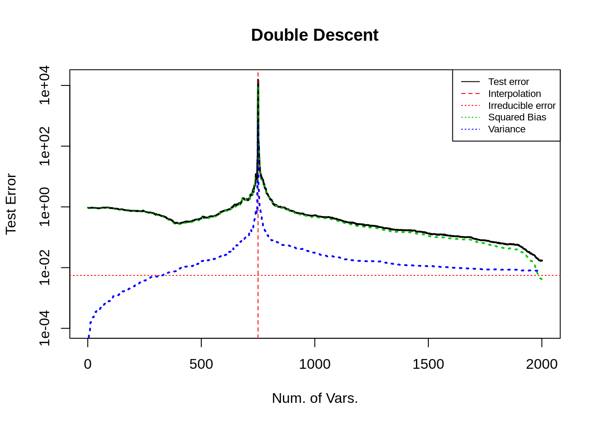

从图中可以看出, 测试误差呈现出了双下降的趋势. 
在插值点 (红色垂直虚线) 左侧, 误差先下降后上升为 U 型, 机理与前文 U curve 3.4 节所述的相同, 且在插值点处的测试误差远大于 $$Y$$ 的方差. 方差项一直增大, 但从绝对大小上看, 相对于偏差项较小, 可忽略. 偏差项于主导了测试误差项的变化. 

下面, 我们调整变量的顺序为随机排序. 

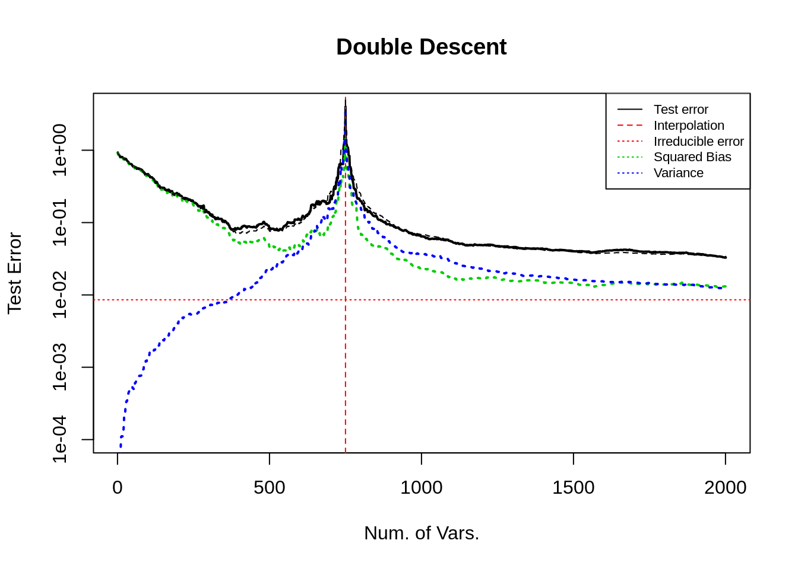

上图, 测试误差曲线更加平顺, U 型部分前半段下降得更快一些 (理由如 U curve 中所述). 


下面, 在上述基础上, 我将第 500--1000 的变量系数设置成 0.

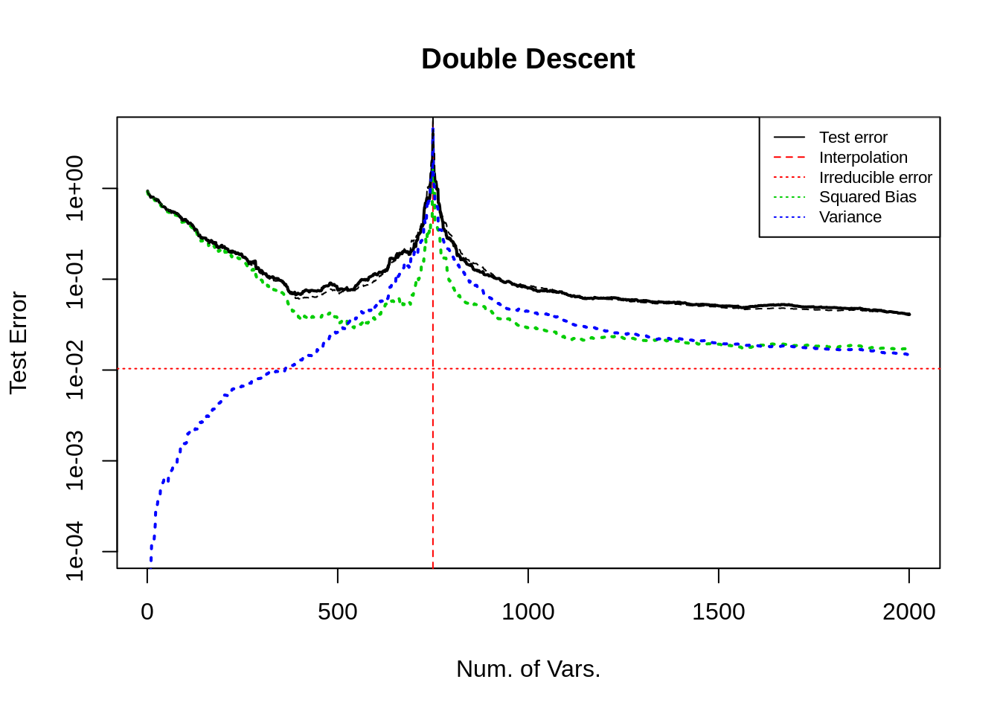

经过仔细核对, 这种设置对册数误差曲线几乎没有影响. 

#### Case 2: 增加冗余变量   

这里, 我增加了 500 个冗余变量于末尾, 其他设定不变. 观察变化. 

**这张图的随机数种子与上面的不同, 因此曲线有些不同, 可以修改一下随机数**


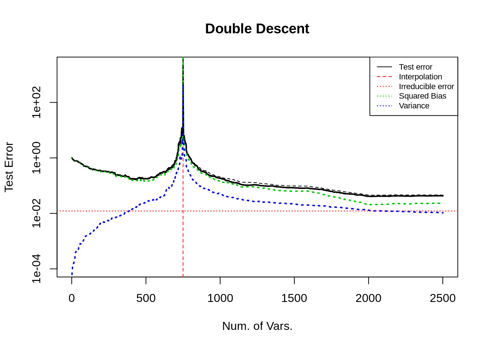

上图表示出, 在 $$p>n$$ (且远离插值点) 时, 增加无用的变量不会改变偏差, 方差几乎不变, 总的来看, 测试误差几乎不改变. 
这提醒我, 如果要降低偏差曲线, 必须要考虑增加有用的变量, 而不是无用的变量. 

**这与 U 型曲线中的现象可能不一致, 需要考虑在 U curve 的实验中也在末尾增加无用的变量, 观察偏差和方差的变化**, 我预计, 偏差不变但是方差会改变. 

#### Case 3: 增大尾部系数的大小

在 base 模型的基础上, 将末尾的 200 个变量对应的系数增大, 且令中间峰值部分的系数为 0 , 最终留下约 1500 个非零系数; 变量随机排序. 
其他设置同前. 


可以让 bias 曲线的尾部下降得更快. 
(这是符合逻辑的结果, 因为 bias 会在重要(大系数)变量纳入模型时下降. 见 U curve 部分. )

#### Case 4: 减小首部系数的大小

在 base 模型的基础上, 我们将开始的 200 个变量对应的系数减小. (base是增大后的结果, 从代码中删去部分行既可. )

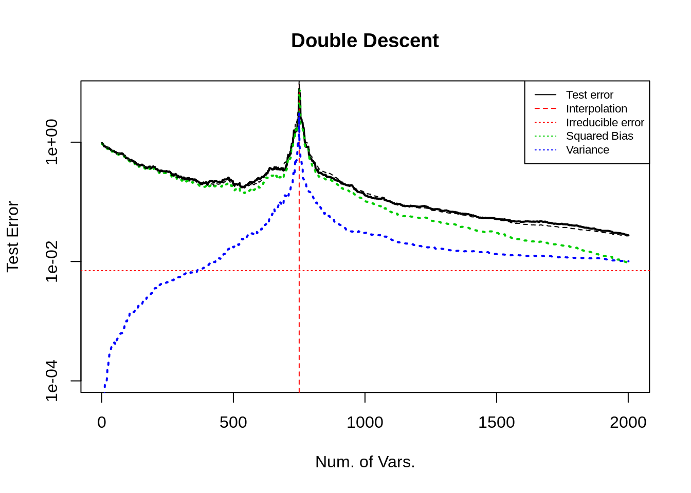

从图中可以看出, 这种设置不改变曲线的走势. 

#### Case 5: 寻找 bias 的极值

寻找 bias 的最大值可以, 参考 U curve 中 Q & A 以及 Case 4 的结果. 

下面我们讨论 bias 的极小值. 
上面的实验中, bias 曲线的最低点并不是 0, 只是一个较小的数字, 我认为是因为设置的系数不可识别. 
我们期望 bias 可以在末尾逐渐递减至 0. 
为此我们从数学出发, 设计一个可以识别的真实系数. 

在高维下的估计量为 $$\hat{\boldsymbol{\beta}} = V \begin{pmatrix}D_1^{-1} \\ \mathbf{0}_{p-n,n}\end{pmatrix} U^T Y$$, 将模型 $$Y_0=X\boldsymbol{\beta}_0$$ 代入.
$$\hat{\boldsymbol{\beta}}_0 = V \begin{pmatrix}D_1^{-1} \\ \mathbf{0}_{p-n,n}\end{pmatrix} U^T U \begin{pmatrix}D_1 & \mathbf{0}_{n,p-n}\end{pmatrix} V^T \boldsymbol{\beta}_0 = V\begin{pmatrix}I_n & \mathbf{0}_{p-n,n} \\\mathbf{0}_{n,p-n} & \mathbf{0}_{p-n,p-n}\end{pmatrix} V^T \boldsymbol{\beta}_0$$. 

要 $$\hat{\boldsymbol{\beta}}_0 = \boldsymbol{\beta}_0$$, 只需要 $$\boldsymbol{\beta}_0 = V\begin{pmatrix}I_n & \mathbf{0}_{p-n,n} \\\mathbf{0}_{n,p-n} & \mathbf{0}_{p-n,p-n}\end{pmatrix} V^T \boldsymbol{\beta}_0$$. 

即 $$\boldsymbol{\beta}_0$$ 是 $$V\begin{pmatrix}I_n & \mathbf{0}_{p-n,n} \\\mathbf{0}_{n,p-n} & \mathbf{0}_{p-n,p-n}\end{pmatrix} V^T$$ 的属于特征值 1 的特征向量. 
由于该线性变换矩阵是幂等的且特征值 1 的重数为 $$n_train$$ (这里简记作 $$n$$), 且 $$V=\{V_1,\dots,V_n, \dots,V_p\}$$ 是该矩阵的特征向量. 只需要取 $$V_1,\dots,V_n$$ 作为基生成的向量作为 $$\boldsymbol{\beta}_0$$ 即可. 

代码只需要稍作修改即可, 结果如下. 

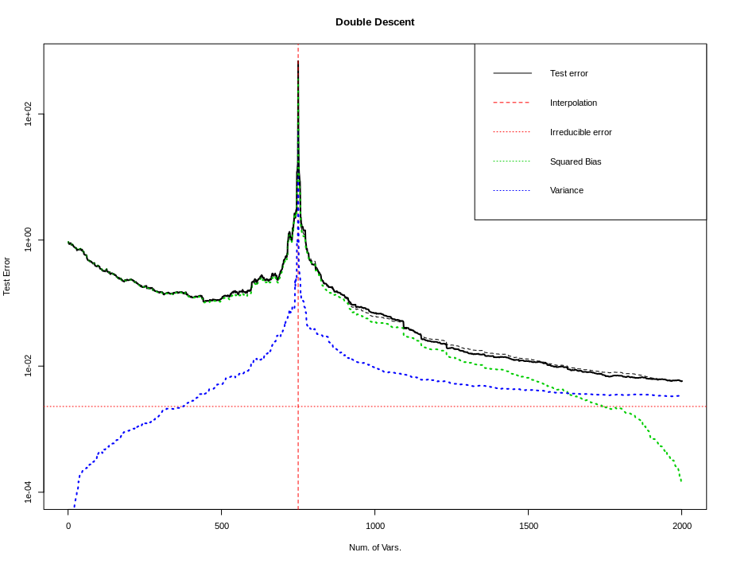
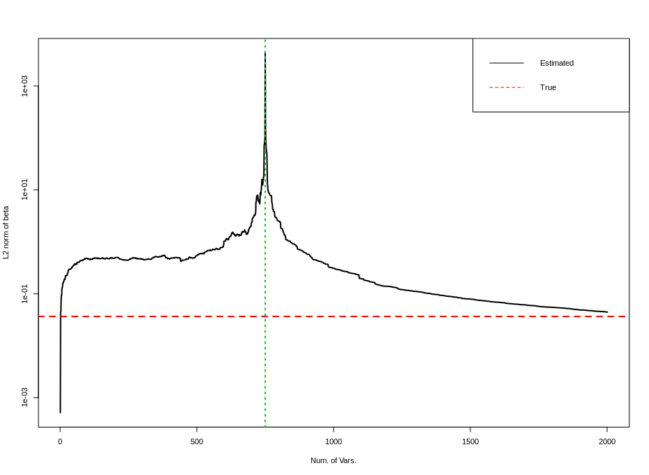

上面两张图分别是测试误差双下降曲线, 以及估计量的 $$\ell_2$$ 范数随着变量增加的曲线. 
第一张图与上面其他所有图的最大不同点在于 bias 曲线在末尾持续下降到几乎为 0 ($$10^{-4}$$ 量级), 此时测试误差曲线是影响测试误差的主要原因. 随着 $$p$$ 增加该项会持续降低. (后文有讨论)

### 3.2 Summary and code

```R
set.seed(1111)
## settings
n <- 1000
p <- 2000   # 2000 2500
n_train <- as.integer(n * 0.75)
n_test <- n - n_train
## model settings
mean_x <- c(rep(0,p))
sigma_x <- matrix(0,p,p)     
for (i in 1:p){
  for (j in 1:p){
    sigma_x[i,j] <- 0.90^abs(i-j)
  }
}

mean_e <- c(rep(0,n))
sigma_e <- diag(x=1,n,n)
x <- mvrnorm(n=n,mean_x,sigma_x)
x <- x[, sample(p)]                        # disorder correlation
e <- mvrnorm(n=1,mean_e,sigma_e) * 2
beta0 <- c(rep(0,p))

### setting beta0
## default case
mean_beta <- rbinom(2000, 10, 0.1) * 4
beta0[1:2000] <- mvrnorm(n=1, mean_beta, diag(2000))
beta0[(1:200)*2] <- rep(40, 200)
beta0[(801:1000)*2] <- rep(40, 200)
beta0[which(abs(beta0) < 1e-1)] <- 0
beta0[500:1000] <- 0
## zero bias curve case in Case 5
# svd_x <- svd(x, nv=p, nu=n_train)
# beta0 <- svd_x$$v[,1]
beta0 <- beta0 / norm(beta0,type="2") * 8  # control SNR
# length(which(abs(beta0) < 1e-3))         # for debug

# linear model
y0 <- x %*% beta0
y <- y0 + e
## some standardization
beta0 <- beta0 / sd(y)
y0 <- y0 / sd(y)
y <- y / sd(y)
```

## 4. Code for calculation, paralleling and plotting

### 4.1 Calculating test error

```R
# sample splitting
x <- cbind(matrix(1,n,1),x)
x_train <- x[1:n_train,]
x_test <- x[(n_train+1):n,]
y_train <- y[1:n_train]
y_test <- y[(n_train+1):n]
y0_train <- y0[1:n_train]
y0_test <- y0[(n_train+1):n]

# oracle predict error
PE0 <- as.numeric(t(y0_test - y_test) %*% (y0_test - y_test)) / n_test
# some criterias 
norm_beta_hat <- rep(0,p+1)
test_error <- rep(0,p+1)
train_error <- rep(0,p+1)
bias <- rep(0,p+1)
variance <- rep(0,p+1)

# main function
my_fun <- function(num_featrues){
  x_train_tmp <- as.matrix(x_train[,1:num_featrues])
  x_test_tmp <- as.matrix(x_test[,1:num_featrues])
  if (ncol(x_train_tmp) <= nrow(x_train_tmp)){
    hat_matrix <- solve(t(x_train_tmp) %*% x_train_tmp) %*% t(x_train_tmp)
    beta_hat <- hat_matrix %*% y_train
    beta_hat_0 <- hat_matrix %*% y0_train
    # beta_hat <- decmps$$v %*% diag(1/decmps$$d) %*% t(decmps$$u[,1:length(decmps$$d)]) %*% y_train
  } else {
    decmps <- svd(x_train_tmp, nu=nrow(x_train_tmp), nv=ncol(x_train_tmp))
    hat_matrix <- decmps$$v %*% rbind(diag(1/decmps$$d),matrix(0,nrow=ncol(x_train_tmp)-nrow(x_train_tmp),ncol=nrow(x_train_tmp))) %*% t(decmps$$u[,1:length(decmps$$d)])
    beta_hat <- hat_matrix %*% y_train
    beta_hat_0 <- hat_matrix %*% y0_train
  }
  
  ## l2-norm of beta hat
  norm_beta_hat_cur <- as.numeric(t(beta_hat) %*% beta_hat)
  ## train error
  tmp_error <- x_train_tmp %*% beta_hat - y_train
  train_error_cur <- as.numeric(t(tmp_error) %*% tmp_error)
  ## test error
  tmp_error <- x_test_tmp %*% beta_hat - y_test
  test_error_cur <- as.numeric(t(tmp_error) %*% tmp_error)
  ## bias term
  # tmp_error <- x_test_tmp %*% beta_hat_0 - x_test[,-1] %*% beta0
  tmp_error <- x_test_tmp %*% beta_hat_0 - y0_test
  bias2 <- as.numeric(t(tmp_error) %*% tmp_error)
  ## variance term
  tmp_error <- x_test_tmp %*% (beta_hat_0 - beta_hat)
  variance <- as.numeric(t(tmp_error) %*% tmp_error)
  
  # outputs
  output <- c(train_error_cur,test_error_cur,norm_beta_hat_cur,bias2,variance)
  output
}

```

### 4.2 Paralleled programming
```R
## parallel
cl <- makeCluster(detectCores()- 5)
clusterEvalQ(cl=cl, library(MASS))
clusterExport(cl, c("x","x_train","x_test","y_train","y_test","y0_train","y0_test","beta0"))
tt <- parSapply(cl, 1:(p+1), my_fun)
stopCluster(cl)

# align resultsw
train_error <- tt[1,] / n_train
test_error <- tt[2,] / n_test
norm_beta_hat <- tt[3,]
bias2 <- tt[4,] / n_test
variance <- tt[5,] / n_test
```

### 4.3 Plot the resulting curve
```R
## plot the results
# the double descent curve
t <- 1:(p+1)
plot(t, test_error, "l", lty=1, lwd=2, col=1, xlab="Num. of Vars.", ylab="Test Error", main="Double Descent", ylim=c(0.0001,max(test_error)), log="y") # 
abline(v=n_train,col=2,lwd=1,lty=2) # vertical line
abline(h=PE0,col=2,lwd=1,lty=3)     # horizon line, oracle test error
lines(t,bias2,col=3,lwd=2,lty=3)
lines(t,variance,col=4,lwd=2,lty=3)
lines(t, PE0+bias2+variance, lty=2) # expected test error
op <- par(cex = 0.7)                # scale the legend
legend("bottomleft",legend=c("Test error","Interpolation","Irreducible error","Squared Bias","Variance"), col=c(1,2,2,3,4), lty=c(1,2,3,3,3))

# train error
plot(t, train_error, "l", lty=1, lwd=2, col=1, xlab="Num. of Vars.", main="Train Error")
abline(v=n_train,col=2,lwd=2,lty=2)

# the U curve
plot(t, test_error, "l", lty=1, lwd=2, col=1, xlab="Num. of Vars.", ylab="Test Error", main="U Curve", xlim=c(0,n_train))

## the curve of norm of beta_hat
plot(t, norm_beta_hat, "l", lty=1, lwd=2, col=1, xlab="Num. of Vars.", ylab="L2 norm of beta", log="y")
abline(h=as.numeric(t(beta0) %*% beta0),col=2,lwd=2,lty=2)
abline(v=n_train,col=3,lwd=2,lty=3)
legend("topright", legend=c("Estimated","True"), col=1:2, lty=1:2)
```

