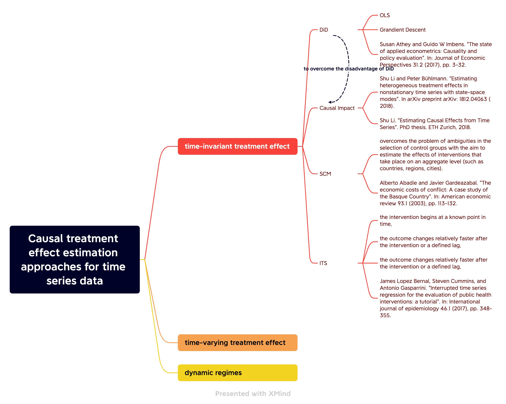
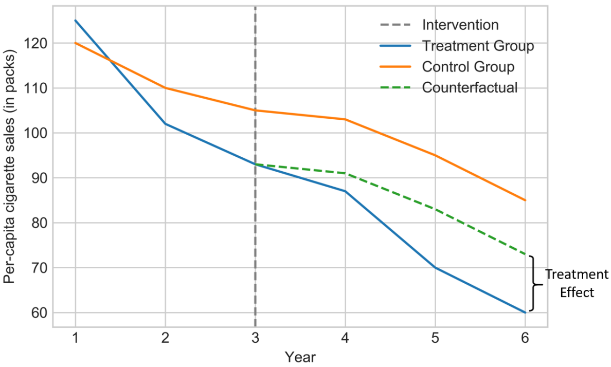
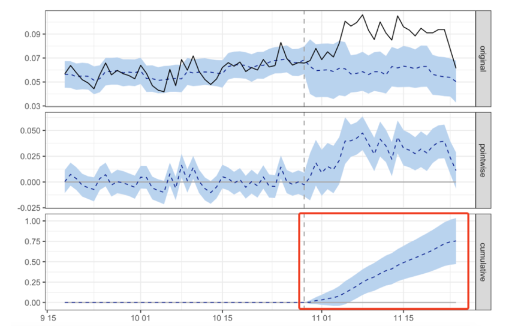
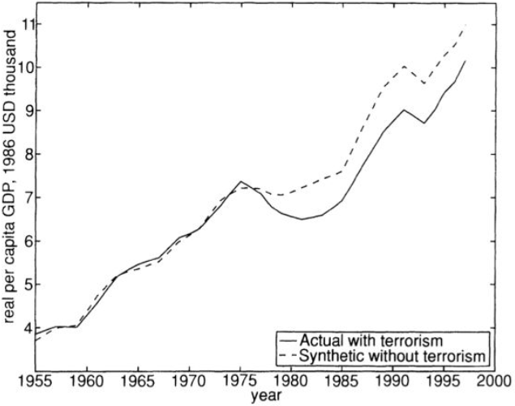
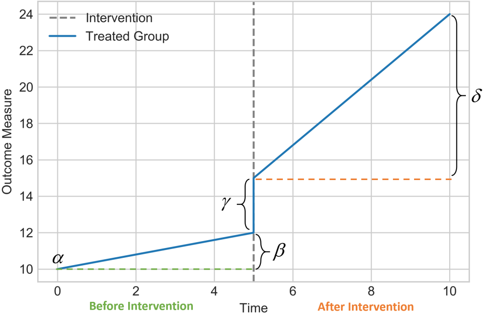

# 时间序列中的因果推断

## 我们想要了解的问题

- 问题背景与数据的描述
  + 数据维度, 数据类型, 范围
  + 数据的实际意义
  + 变量之间直观上存在的关系
- 目标的描述
  + 是否进行效果评估 (或政策评估, 或处理效应估计)?
  + 是否需要进行假设检验? 
  + 是否需要根据估计效果, 构建最优策略? 
- 预想的结果
- 建议
  + 能否进行随机化的效果评估, 进行 A/B test? 因为随机化实验可以极大简化因果推断.

[这是本文的 HTML 版本](https://huihangliu.github.io/policycausal/), 更方便阅读. 下面是一些方法的总结.

## Summary on Causal Inference for Time Series Analysis

In this note, we summarize the content of the [*Raha Moraffah et al. (2021)*](https://arxiv.org/pdf/2102.05829.pdf). This includes three main types of causal treatment effects estimation for time series data. Currently, we focus on the time-invariant treatment effect and traditional statistics methods. 

The state-of-the-art causal treatment effect estimation approaches for time series data can be categorized into three main types:
- [1. time-invariant treatment effect](#1-time-invariant-treatment-effect);
- [2. time-varying treatment effect](#2-time-varying-treatment-effect);
- [3. dynamic treatment regimes](#3-dynamic-treatment-regimes).

The following figure is a road-map of this note. 

### 1 Time-invariant Treatment Effect
- **What is time-invariant treatment effect?** 
  + A treatment is time-invariant or fixed when it occurs at one specfic point of time and then does not change afterward.

- Let $X(t)$ be the time sereis outcome recorded at times $t = 1,2,\dots,n$, and let $A$ be a dichotomous treatment that can take values $a=0$ (untreated) or $a=1$ (treated). We will have:
    + $X_a$: the potential outcome for the treatment group (when $a=1$) or control group (when a=0).
    + $T$: $1\leq T\leq n$, the time when the intervention occurs.
    + $X_{a=1}^c(t>T)$: potential outcome of the treatment group at $t>T$ had it not received the treatment which is known as the **counterfactual outcome**.
- In the following section, we will introduce common time-invariant causal effect estimation methods.

#### 1.1 Difference in Difference (DID)

- DID is an important tool mostly used by the econometricians to capture the **average causal effect** of the time series data before and after the treatment. 
- This tool goes by an **assumption** called *common trends* or *parallel trends* that uses the change of the outcome of the control group as a counterfactual for the treatment group in the absence of the treatment.

The following figure is an illustration of the DID method. 

- If $t<T$ and $t>T$ denotes the pre- and post- treatment periods, respectively, then we can calculate the DID measure using the average treatment effect of the treated (ATT) metrics as follows[^1]:

$$\begin{aligned}\text{DID}&=\{E[X(t>T)\mid A=1]-E[X(t<T)\mid A=1]\}\\&-\{E[X(t>T)\mid A=0]-E[X(t<T)\mid A=0]\}.\end{aligned}$$

- A common solution to model the DID causal effect is to specify a linear regression model for the observed outcome. In case of one intervention and one treatment group we will have:
$$X=\alpha+\beta g+\gamma t +\delta(g\times t)+e,$$
-  
  + $\alpha,\beta,\gamma$ and $\delta$ are the regression coefficients. 
  + $g$ is a dummy variable indicating the treatment group (1 for treatment and 0 for the control group), 
  + $t$ is a dummy variable defining the pre- or post-treatment periods (0 for before and 1 for after the treatment time)
  + $g\times t$ is the interaction term to count the DID causal effect with $\delta$ being its coefficient
  + $e$ is the error term which is independent of other variables.
- The parameters of this regression can be estimated by the available methods solving regression models such as **OLS**.
- **The disadvantage of DID**: 
  + If it fits to **highly autocorrelated data**, the model **underestimates** the effect of the intervention.
- For a comprehensive survey on this metric, the author refer the readers to two sutdies provided by Lencher (2011)[^2] and Bertrand et al. (2004) [^3].

- **Related Papers**: 
  + Susan Athey and Guido W Imbens. "*The state of applied econometrics: Causality and policy evaluation*". In: *Journal of Economic Perspectives 31.2 (2017), pp. 3-32*.
  + Susan Athey and Guido W Imbens: "*Identification and inference in nonlinear difference-in-differences models*". In: *Ecnonmetrica 74.2 (2006), pp. 431-497*. 
  + Marianne Bertrand, Esther Duflo, and Sendhil Mullaninathan. "*How much should we trust differences-in-differences estimator?*" In: *The Quarterly journal of economics* 119.1 (2004), pp. 249-275.
  +  Michael Lechner et al. *The estimation of causal effects by difference-in-difference methods*. Now, 2011.

#### 1.2 Causal Impact

- This method <u>generalizes the concept of the DID</u> and structural time-series model to infer the causal impact of a **discrete intervention** (e.g. the release of a new product). Causal Impact 基于贝叶斯结构时间序列模型, 综合多种信息输入结合自身的时间序列来构造一个策略未上线的虚拟值.
- **Advantages**: The assumption of DID on the common trend is weakened. (但依然需要选择合适的控制组.) 
- **Applications**: It is widely used for various applications such as the impact of vaccines, the environmental impact of aircraft emissions and aviation ful tax, and the impact of mobile phone use on brain cancer.

The following figure is an illustration of causal impact method. See [this blog](https://maimai.cn/article/detail?fid=1607599585&efid=hQNw4-sFnNlf-k8RrhcNmw) for details. 
- Subfig 1 (original): 黑色实线为被处理样本的实际观测结果, 蓝色虚线为根据某个控制样本模拟的被处理样本的结果, 蓝色区域为置信区间.
- Subfig 2 (pointwise): 蓝色虚线为被处理样本的实际观测结果与模拟结果的差值, 可以看到实施处理后, 结果的差值是显著为正的.
- Subfig 3 (cumulative): 蓝色虚线为实施处理后的累加值, 是持续增大的, 可见处理有明显的正向作用.

- Causal impact learns the relationship between the treatment and control group before any intervention and predicts the counterafctual series after the treatment. This method relies on state-space models as follows:

$$
\begin{align*}
  \begin{aligned}
    X(t) &= \mu(t)+\beta Z(t)+\upsilon(t)\\\mu(t)&=\mu(t-1)+\delta(t-1)+\omega(t)\\
    \delta(t) &= \delta(t-1)+u(t),
  \end{aligned}
\end{align*}
$$

- + $Z(t)$ is the control time series and is related to the treatment time series (i.e. $X(t)$) through the $\beta$ components.
  + $\upsilon(t)$, $\omega(t)$ and $u(t)$ are zero-mean noise variables.
  + $\mu(t)$ models the temporal correlation in $X(t)$.
  + $\delta(t)$ component can be thought of as the slope at time $t-1$ or the expected increase in $\mu$ between times $t-1$ and $t$.
- The model is fitted to the observed data $t=1,2,\dots,T$, treating the counterfactual $t=T+1,T+2,\dots,n$ as unobserved random variables.
- The model will compute the posterior distribution of the counterfactual time series. <u>The causal effect is estimated by subtracting the predicted from the observed treated time series.</u>
- **Related Papers**: 
  + Shu Li and Peter Bühlmann. "*[Estimating heterogeneous treatment effects in nonstationary time series with state-space modes](https://arxiv.org/abs/1812.04063)*". In *arXiv preprint arXiv: 1812.04063 (2020)*.
  + Shu Li. "*[Estimating Causal Effects from Time Series](https://www.research-collection.ethz.ch/bitstream/handle/20.500.11850/320119/thesis.pdf?sequence=1&isAllowed=y)*". PhD thesis. ETH Zurich, 2018.
  + Kay H Brodersen et al. "*Inferring causal impact using Bayesian structural time-series models*". In: *The Annals of Applied Statistics* 9.1 (2015), pp. 247-274.
  

#### 1.3 Synthetic Control Method (SCM)

- *Synthetic Control Method* (SCM) introduced by Abadie and Gareazabal in 2003 overcomes the problem of ambiguities in the selection of control groups with the aim to estimate the effects of interventions that take place on an aggregate level (such as countries, regions, cities).
- **Advantages**: 完全去除了对控制组的同趋势假设. 
- This method has been introduced in the seminar.
- **Related Papers**: 
  + Alberto Abadie and Javier Gardeazabal. "*The economic costs of conflict: A case study of the Basque Country*". In: *American economic review 93.1 (2003), pp. 113-132*.

The following figure is an illustration of SCM. See [this Q&A](https://www.zhihu.com/question/43497862/answer/1874867221) for details. 

#### 1.4 Interrupted Time Series (ITS)

这里, 我们考虑一项政策或处理, 在全体样本上展开; 即不存在对照组的情况. 
此时, 我们只能分别从处理前后的两段数据中分别拟合模型, 寻找规律. 因此, 这种方法十分依赖于模型设置. 

- **Requirement**:
  + the intervention begins at a known point in time,
  + the outcome changes relatively faster after the intervention or a defined lag,
  + the outcome lasts long enough to measure.

- The standard ITS model is capable of finding the causal effect of an intervention for only one time series (i.e. when the control unit data is not available). It is built upon a simple idea that the data generating process would have continued in a similar way in the absence of the intervention, which is a special case of *regression Discontinuity Design* (RDD) when the discontinuity happens in time.

- Therefore, to find immediate changes in the outcome value and the change in the trend of the time series in the post-intervention period compared to the pre-intervention period, "Segmented Regression" (分段回归) is used[^4]:

$$
\begin{align*}
  \begin{aligned}
    Y=\alpha+\beta T+\gamma t+\delta (T\times t)+e,
  \end{aligned}
\end{align*}
$$

- + $\alpha$ indicates the baseline level at $T=0$,
  + $\beta$ represents the baseline trend (i.e. pre-intervention trend),
  + $\gamma$ is the immediate level change following the intervention,
  + $\delta$ indicates the post-intervention trend
  + $e$ is the error.

The following figure is an illustration of the Standard ITS method.

See [this Q&A](https://zhuanlan.zhihu.com/p/539045445) for details. 

- **Related Papers**: 
  + James Lopez Bernal, Steven Cummins, and Antonio Gasparrini. "*Interrupted time series regression for the evaluation of public health interventions: a tutorial*". In: *International journal of epidemiology 46.1 (2017), pp. 348-355*.
  + Robert B Penfold and Fang Zhang. "*Use of interrupted time series analysis in evaluating health care quality improvements*". In *Academic pediatrics 13.6 (2013), S38-S44*.

### 2 Time-varying Treatment Effect

- In this case, A, the treatment variable, would be time-dependent and is recorded throughout all the time, i.e.,

$$(A(t)=\{A(1),A(2),\dots,A(n)\}).$$

### 3 Dynamic Treatment Regimes
- A dynamic treatment regime is a function which takes in treatment and covariate history as arguments and outputs an action to be taken, providing a list of decision rules for how treatment should be allocated over time.

### 4 Other Supplementary Machine Learning Method

- *Double Machine Learning* (DML)
  + Paper: [Chernozhukov et al. (2018)](https://doi.org/10.1111/ectj.12097) 
  + Code: [DoubleML](https://docs.doubleml.org/stable/index.html) 

[^1]: Susan Athey and Guido W Imbens: "*Identification and inference in nonlinear difference-in-differences models*". In: *Ecnonmetrica 74.2 (2006), pp. 431-497*. 
[^2]: Michael Lechner et al. *The estimation of causal effects by difference-in-difference methods*. Now, 2011.
[^3]: Marianne Bertrand, Esther Duflo, and Sendhil Mullaninathan. "*How much should we trust differences-in-differences estimator?*" In: *The Quarterly journal of economics* 119.1 (2004), pp. 249-275.
[^4]: Robert B Penfold and Fang Zhang. "*Use of interrupted time series analysis in evaluating health care quality improvements*". In *Academic pediatrics 13.6 (2013), S38-S44*.